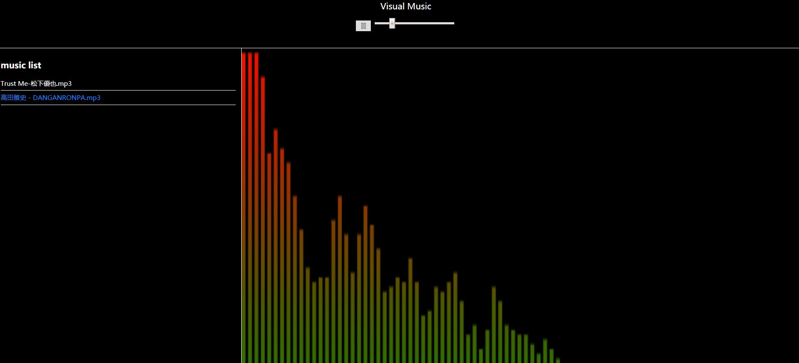

# visual-music

参考慕课网[HTML5音乐可视化](https://www.imooc.com/learn/299)  
`webAudio` API不支持IE，兼容性参考[can i use](https://caniuse.com/#search=webaudio)
## install/安装依赖

`npm install` or `yarn`
## dev/开发模式
client side/启用前端:  
```
npm run dev
``` 
port: 1001  
server side/启用后台:  
```
npm run server
```
port: 3000